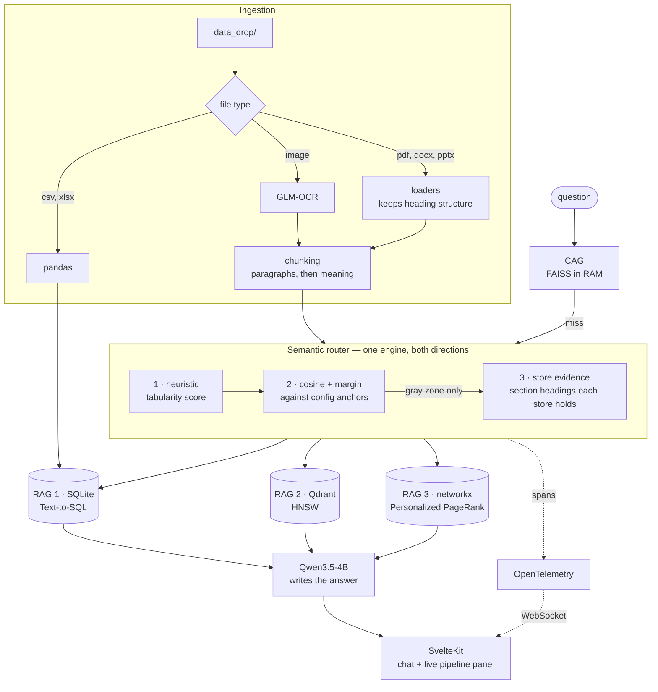
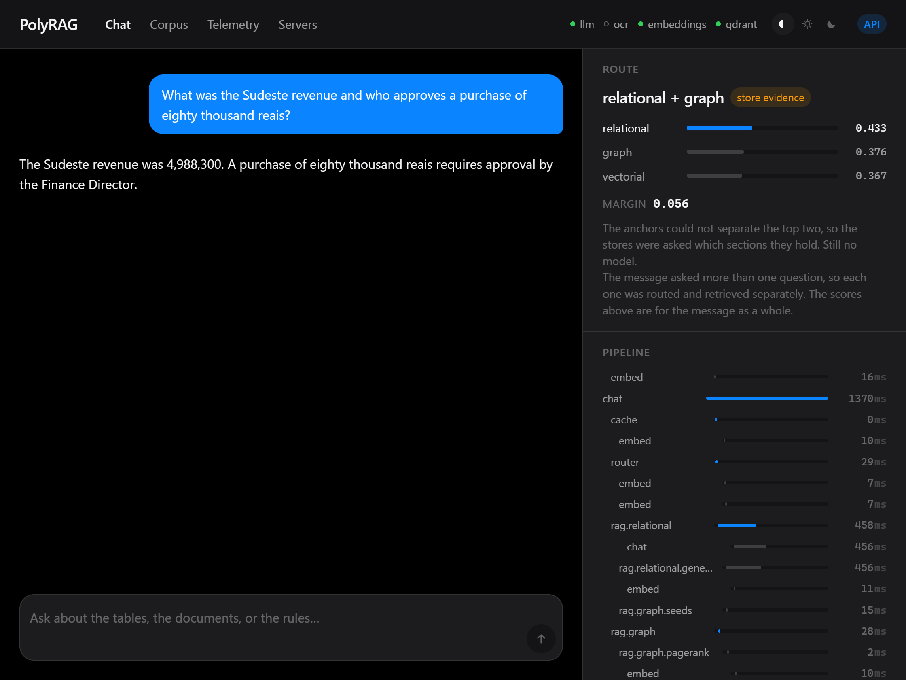
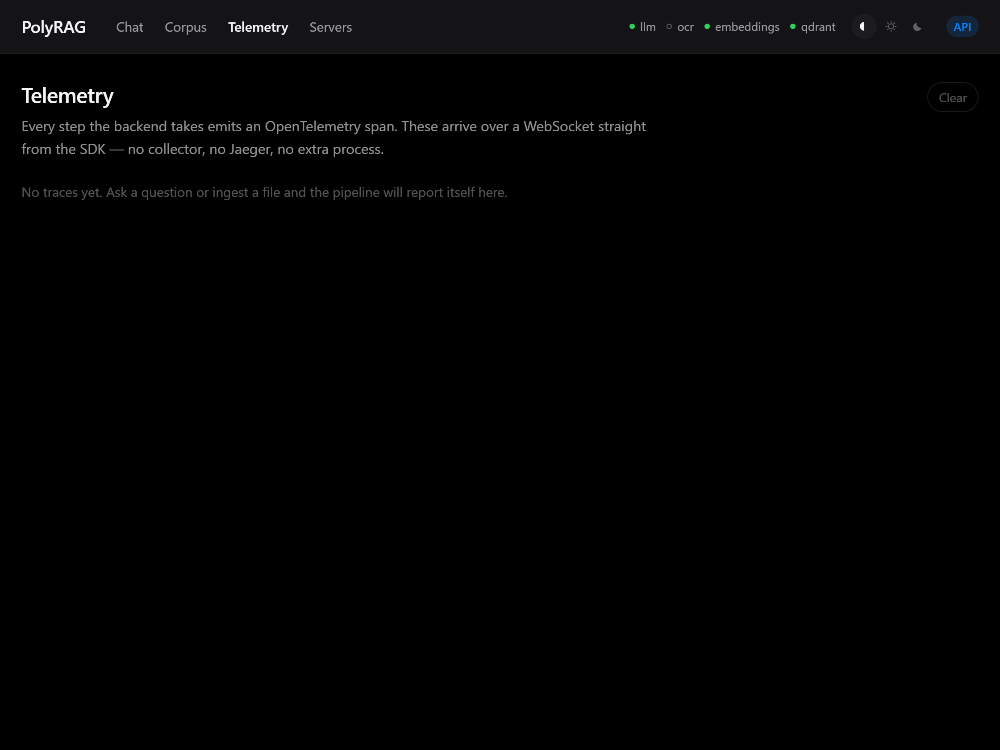

<div align="center">

# PolyRAG

**A federated RAG system that routes questions with arithmetic instead of an agent —
and shows you the arithmetic while it does it.**

[](https://github.com/diegormirhan/polyrag/actions/workflows/ci.yml)
[](https://github.com/diegormirhan/polyrag/tags)
[](.python-version)
[](frontend/)

[](#running-it)
[](#running-it)
[](#running-it)
[](#running-it)

[What it does](#the-problem-it-takes-seriously) ·
[Architecture](#architecture) ·
[The router](#the-router) ·
[Measurements](#what-is-measured) ·
[The maths](#the-maths-in-one-page) ·
[Run it](#running-it) ·
[Limits](#known-limitations)

</div>

---

Drop a spreadsheet, a scanned receipt and a policy document into one folder. PolyRAG reads each one,
splits it, and decides — per chunk — whether it belongs in a SQL table, a vector index, or a
knowledge graph. Ask a question and the same decision runs again to pick where to look. Every step
reports itself, so you can watch the routing happen and see the numbers behind it.

Runs entirely on one machine: AMD GPU through Vulkan, no CUDA, no Docker, no cloud.


*A question whose answer spans two documents that never mention each other. The right panel is the
whole point: the score each route got, the margin that decided it, and every step with its own
latency, `rag.graph.pagerank` at 1 ms next to `chat.stream` at 588 ms.*

*The question is English and the corpus is Portuguese. Routing, retrieval and the answer all work
across the two because BGE-M3 embeds both into the same space; the sources are shown in the language
they were written in, untranslated.*

---

## The problem it takes seriously

Agent-based RAG delegates routing to a model. That makes behaviour unpredictable — the same question
can take a different path on Tuesday, and nobody can explain why. That is what stops these systems
from being testable, debuggable or auditable.

PolyRAG's premise is the opposite: **use deterministic maths wherever it can decide, and reserve the
model for what only a model can do.**

| Step | How it decides | Deterministic? |
|---|---|---|
| Is this file tabular? | Regex + comma/digit density | ✅ |
| Which store does this belong in? | Cosine similarity + margin | ✅ |
| Is this question already answered? | Cosine ≥ threshold | ✅ |
| Which graph chunks matter? | Personalized PageRank | ✅ |
| Genuine tie between two routes | Cosine against the headings each store holds | ✅ |
| Does this message ask more than one question? | Clause split + interrogative test | ✅ |
| Writing the answer | A model | ⚠️ temperature 0 |

The claim is not a new algorithm. It is that **routing does not need one** — and that a system which
can explain its own decisions is worth more than one that guesses well.

---

## Architecture



Three models served by `llama.cpp` over Vulkan, each on its own port, all speaking the OpenAI API:
**Qwen3.5-4B** (SQL, triple extraction on ingest, and the answer — nothing in the router),
**GLM-OCR** (images),
**BGE-M3** (embeddings). Qdrant runs standalone alongside them. OCR sleeps when idle and hands its
VRAM back, so the resident set is about 5.6 GB.

---

## The router

The same component decides where a chunk is **stored** and where a question is **searched** — the
input is the only difference. It runs three stages, cheapest first:

**1 · Heuristic.** Comma and digit density. A spreadsheet is tabular by definition and never reaches
the model. Cost: microseconds.

**2 · Cosine + margin.** Each route is defined in `config.yaml` by a handful of example phrases,
embedded once at startup. The input is embedded and compared against all of them; the best match per
route becomes that route's score.

```
margin = score_top1 − score_top2

score_top1 ≥ tau_high  AND  margin ≥ delta   →  take it
score_top1 < tau_low                          →  fall back to free text
otherwise                                     →  gray zone, go to stage 3
```

This is a 1-nearest-neighbour classifier with a rejection rule. Cost: **8.8 ms**, measured.

**3 · Store evidence.** Only in the gray zone. The configured phrases say what a route is *for*;
they cannot know what a corpus turned out to contain. So each store is asked for the section
headings it actually holds (`RAGBase.content_anchors`), and the question is scored against those
too. Ingesting a document teaches the router about it with no config edit.

**There is no model in any of the three stages.** A model used to break the gray-zone tie, and it
was measured out: on those questions, stage 2 alone was right 9 times out of 10 and the judge 8. It
agreed with the geometry in 9 of the 10 — two model calls to repeat what arithmetic had already
said — and the one time it disagreed, it was wrong. Store headings took routing on unseen questions
from 82% to 95% instead.


*The gray zone, resolved without a model. Nothing hand-written in `config.yaml` could know that
"Banco de Dados Órion" names a section in the graph — so this question used to go to the relational
store, whose only table is about sales.*

### When the message asks more than one question

> *"Qual foi a receita do mês de março **e** qual norma regula a retenção desses registros?"*

The figure is in SQL and the rule is in the graph, and picking one store answers half the message.
So each question is routed on its own, and each store is queried **with the text of its own
question** — not with the whole message. That last part is not a detail: handing the full sentence
to the Text-to-SQL step produced a query the guards rejected, and the relational half went
unanswered.

Detecting the case is where this got interesting. The obvious rule is a threshold on the router's
second-best score, and it was measured and thrown away: **compound questions score `top2` between
0.365 and 0.511, single ones between 0.303 and 0.476.** The ranges overlap almost completely, and
the plainly single question *"Como uma reclamação de cliente deve ser tratada?"* (0.476) outscores
five of the seven compound ones. The cause is mechanical — an embedding of two subjects lands near
their *average*, so a second subject dilutes both scores instead of lifting the second. It is the
same shape of failure as the cache threshold below, and no cutoff separates it.

What separates them is structure. A compound message contains two questions, so `clauses.py` splits
on clause boundaries (`?`, `;`, `e`, `and`) and requires **every** surviving fragment to contain an
interrogative. Without that second test, two of the 80 evaluation questions split wrongly: *"Uma
exportação sem anonimização **e** reportada para quem?"*, where the `e` is the verb *é* written
unaccented, and *"Qual a diferença entre um atraso comunicado **e** um atraso descoberto?"*, where
it joins two noun phrases. In both, one half asks nothing at all.

Measured: **9 of 9 compound messages detected, 0 false positives in 80 single questions.** The
stores are then queried with `asyncio.gather` and their results concatenated under `[SQL]`,
`[TEXT]` and `[GRAPH]` labels — not fused by RRF, because RRF merges two rankings *of the same
items*, and here the stores hold disjoint content and one of them returns a SQL result table rather
than a ranked list.



*One message asking a figure and a rule. The route line reads `relational + graph`, and the answer
carries both halves: the `SUM` from the sales table and the approval threshold from the compliance
graph.*

### Lost in the middle

Retrieved passages are reordered before the model reads them, following Liu et al. 2023: a model
attends to the start and the end of a context and least to its middle. Ranks 1, 3, 5 go out in order
and 2, 4 come back reversed, so `[1,2,3,4,5]` becomes `[1,3,5,4,2]` — the best passage opens the
context and the second best closes it. Pure list slicing; the ranking was already done. SQL rows are
left alone, because their order is the `ORDER BY` that selected them.

---

## Three stores, because there are three kinds of data

| | Holds | Retrieved by | Why not the others |
|---|---|---|---|
| **RAG 1** · SQLite | Rows and columns | Generated SQL | Aggregation must be exact. Correct SQL gives the correct number; no model does the arithmetic. |
| **RAG 2** · Qdrant | Free text | Cosine over HNSW | No schema to impose, no relations to model — only meaning. |
| **RAG 3** · networkx | Entities and relations | Personalized PageRank | Multi-hop. "If A fails, what breaks?" needs topology, not similarity. |


*Why the first row of that table matters. The source is not a passage — it is the query that was
run and the row it returned. The figure came out of a `SUM`, so it is either right or the SQL is
wrong, and the SQL is on screen either way.*

RAG 3 is HippoRAG 2 reimplemented from the [paper](https://arxiv.org/pdf/2502.14802): the model
extracts subject–relation–object triples, networkx holds the graph, and the walk teleports back to
the question's entities so the ranking means "relevant to *this* question".

The official `hipporag` package needs `torch` and `vLLM`, which are Linux/CUDA only. Reimplementing
it was a constraint, and it turned out to be the more useful outcome — the maths is visible and
testable rather than hidden behind an import.


*Routing is per chunk, not per file, which is why four of the six files show up in two stores. The
row worth looking at is `sobre_a_meridiano.md`: one of its five paragraphs sits close enough to the
routing boundary that rewording a route anchor moved it into the graph, and three questions that
depended on it lost their answer. The split is also where the ingestion fallback shows: a chunk the
graph could extract no relation from is kept as free text rather than dropped.*

---

## What is measured

`uv run python scripts/benchmark.py` on this machine (RX 9060 XT, 16 GB), 12 measured runs per
question after 2 discarded warm-ups. A single number cannot describe a latency — the first call
after a model loads pays for a cold cache, and the tail is what a user notices — so every row is
p50 and p95 rather than an average.

| | p50 | p95 |
|---|---:|---:|
| Routing decision (deterministic stage) | **8.8 ms** | 12.0 ms |
| Routing decision on the wire, streaming | **39 ms** | 54 ms |
| Time to first token | **114 ms** | 185 ms |
| Full answer, vectorial | **252 ms** | 255 ms |
| Full answer, graph | **724 ms** | 744 ms |
| Full answer, relational | **737 ms** | 745 ms |
| Cache hit, same question | **9.3 ms** | 12.9 ms |
| Share of a request spent inside model calls | **99 %** | |

Per stage, from each request's own spans rather than a second set of timers:
`pipeline.router` 8.8 ms, `rag.relational.generate_sql` 374 ms, `pipeline.rag.graph` 19 ms
(`rag.graph.seeds` 10.0, `rag.graph.fuse` 8.1, `rag.graph.pagerank` 1.0).

**The whole graph route costs 19 ms, and the model then spends 700 writing the answer.** Retrieval
is not where the time goes.

That used to read very differently. Seeding the walk cost **100 ms** — ten times the PageRank it
feeds — because every entity in the graph was re-embedded on every single query, and the cost grew
with the corpus: 76 ms at 40 entities, 100 ms at 51. Entity names and chunk texts never change once
stored, so their vectors are now computed once and kept. The span attribute `graph.embedded` reports
how many had to be computed on that query, so if this ever regresses it will say so rather than hide.

Two changes worth their own line, because both were found by instrumenting rather than guessing:

- **OpenIE 42.7 s → 7.4 s.** The GPU was 3.6 GB over capacity and streaming weights from system RAM.
  Sleeping the two intermittently-used models and halving the KV cache fixed it.
- **Answer accuracy 4/6 → 6/6** on a repeated multi-hop question, by dropping generation temperature
  from 0.2 to 0. Sampling was silently corrupting a third of the answers. *(n = 6, one question —
  enough to justify a free change, not enough to be a benchmark.)*

### Retrieval and answers, on two sets of 40 questions

Two sets, because one is not enough to tell capability from fit. `golden_set.yaml` is where the
failures were diagnosed and the thresholds chosen, which makes it a training set. `holdout_set.yaml`
was written afterwards from the same six documents and was never consulted while choosing an anchor,
a threshold or an algorithm. **The held-out column is the honest estimate**; the gap between the two
is the overfitting.

```bash
uv run python scripts/evaluate.py --reset                       # wipe, re-ingest, measure
uv run python scripts/evaluate.py --set eval/holdout_set.yaml   # same corpus, other questions
uv run python scripts/evaluate.py --set eval/compound_set.yaml  # messages that ask two questions
```

`--reset` is not a convenience. Measuring against whatever the stores happen to hold is how a number
outlives the code that produced it, and that is exactly what happened here: the router's anchors were
rewritten, the corpus was never re-ingested, and the figures below were for a while describing a
chunk distribution this code no longer produces. Re-ingesting moved one paragraph of the company
history from the vector store to the graph, and three questions that had been passing started to
fail. The numbers here are from one `--reset` run, with the held-out set measured on the corpus that
run produced.

|              |  n | router | r@1 | r@5 | MRR | empty | facts |
|---|---:|---:|---:|---:|---:|---:|---:|
| **golden, overall**   | 40 | 90% | 70% | 84% | 0.78 | 4% | 89% |
| relational   | 12 | 100% | — | — | — | — | 100% |
| vectorial    | 12 | 83% | 67% | 75% | 0.71 | 8% | 75% |
| graph        | 16 | 88% | 72% | 91% | 0.83 | 0% | 87% |
| **held-out, overall** | 40 | **95%** | 68% | **86%** | 0.77 | **0%** | **92%** |
| relational   | 12 | 100% | — | — | — | — | 100% |
| vectorial    | 12 | 92% | 58% | 75% | 0.67 | 0% | 80% |
| graph        | 16 | 94% | 75% | 94% | 0.84 | 0% | 93% |
| **compound, overall** | 10 | 90% | — | — | — | — | 90% |
| relational + graph | 5 | 80% | — | — | — | — | 80% |
| relational + vectorial | 2 | 100% | — | — | — | — | 100% |
| vectorial + graph | 3 | 100% | — | — | — | — | 100% |

`eval/compound_set.yaml` is a third, smaller set of messages that each ask **two** questions. It
exists because neither 40-question set can measure multi-route retrieval — every entry in them asks
one thing. `router` there means "every store that had to be consulted was consulted", and each entry
lists one fact from *each* half, so answering only one half counts as a failure. `recall@k` is not
reported for it: each half is retrieved from its own store with its own text, so there is no single
ranked list to score.

The held-out set scores **higher** than the set the thresholds were tuned against, which is the
opposite of what overfitting looks like. The explanation is not that the tuning generalised
unusually well: the golden set simply holds more of the hard vectorial cases, and the vectorial
route is the weak one on both.

Where it started, before any of this: router 88%, recall@5 **57%**, empty **39%**, facts 74%.

`facts` asks whether the answer contained the figure or proper noun it had to contain — restricted
to what a model cannot legitimately reword, so a substring check measures correctness rather than
phrasing. Case, accents, thousands separators and number words are normalised on both sides, so
"cinco" and "5" count as the same answer. `recall@k` does not apply to the relational route, which
returns SQL rows rather than passages.

**`recall@1` has an arithmetic ceiling.** Three questions need two passages to be fully answered,
and no single chunk contains both, so the best achievable r@1 on these sets is 95%. It is also not
what the system serves: the answer step receives the top 5.

**The weak route is `vectorial`, and one paragraph explains most of what is left.** Re-ingesting
moved the company-history paragraph about tracking terminals from the vector store to the graph, and
the questions that needed it went to 0% recall in their own route. The chunk sits close enough to
the routing boundary that rewording the anchors moves it, which is a real fragility of anchor-based
ingestion and not a measurement artefact.

It used to explain considerably more. On the golden set the route was at 75% routing and 62% facts,
and a heading bug was most of the gap: `section_headings` drops a document's own title, because a
title names a file rather than a subject — but it tested for a leading `#`, and by the time a chunk
carries its heading trail the `#` is gone. `sobre_a_meridiano.md` has a single `# Sobre a Meridiano
Logística` and no subheadings, so one of its paragraphs landing in the graph taught the router that
the graph holds *"Sobre a Meridiano Logística"*, and every question naming the company went there —
including "em que ano a Meridiano Logística foi fundada", whose answer is in the vector store. With
the title excluded as it was always meant to be, that route reads 83% and 75%.

#### What the measurement changed

**Named-entity extraction was removed from the search path.** It returned an empty list for 6 of the
16 graph questions — every one of them a question that *describes* what it wants instead of naming
it ("which rule governs personal data") — and graph search then returned nothing at all. Matching
the whole question against the entity names finds the right node in all 16, and deletes a model call
from every graph query. `empty` went from 39% to 0%.

**The model that broke routing ties was removed.** On the gray-zone questions, stage 2 alone was
right 9 times out of 10 and the judge 8. It agreed with the geometry in 9 of the 10 — two model
calls to repeat what arithmetic had already said — and the one time it disagreed, it was wrong.
Stage 3 now asks each store for its section headings instead, which took routing on unseen questions
from 82% to 95%: nothing written by hand in `config.yaml` could know that "Banco de Dados Órion"
names a section in the graph. **Every stage of the router is now arithmetic.**

Those headings are re-read after every ingestion, not only at startup. They used to be a boot
snapshot, so a file dropped into the hot folder was invisible to the gray zone until the process
restarted: measured on a live backend, a question about a subject the new file had just introduced
scored 0.441 and answered "there is no information", and the same question after a restart scored
0.662 and answered correctly.

**A reranker was not built.** The plan had recorded a suspicion that retrieval scores clustered too
tightly and that reranking was the fix. Conditioned on retrieval returning anything, recall@5 was
already 94% — the ordering was right and the coverage was not. That week would have gone to the
wrong half of the pipeline.

**Two things the SQL route was doing quietly.** Asked a question the sales table cannot answer, the
model wrote `SELECT * FROM vendas_2026_q1` and five arbitrary rows became the context for a
confident answer about the wrong subject. Worse, one query answered from itself:
`SELECT 'Banco de Dados Orion' AS banco, 'tempo real' AS frequencia FROM vendas_2026_q1` — valid,
read-only, and a hallucination wearing SQL syntax. Both are now rejected structurally, and a store
that returns nothing hands the question to the vector store instead of giving up.

**A margin rule on the gray zone was tried and rejected.** Stage 3 decides outright, with no margin
test of its own, and requiring it to beat the runner-up by `delta_margin` before overruling stage 2
looked obviously right: it would have stopped a heading from flipping a call the geometry had made
correctly by 0.496 to 0.489. On the golden set it did exactly that — routing 90% → 95%, facts 89% →
94%, the graph route perfect. On the held-out set it broke two other questions and took routing
95% → 90%. **Six errors in eighty questions before, six after.** It moved them rather than removing
them, and only looked like an improvement on the set it was chosen against. This is the one result
here that the held-out set alone could produce, and it is why the two files are kept apart.

Per-question detail, including every answer, is in `eval/golden_results.json`,
`eval/holdout_results.json` and `eval/compound_results.json`.

---

## The maths, in one page

Nothing here is hidden behind a library call. Every formula below is implemented in this repository
and covered by tests that run without a GPU.

**Embeddings.** BGE-M3 turns any text into 1024 numbers. Texts that mean similar things point in
similar directions — meaning becomes geometry, and comparing meanings becomes arithmetic.

**Normalisation.** Dividing a vector by its own length puts every vector on the unit sphere:

```
‖v‖ = √(v₁² + v₂² + … + vₙ²)          v̂ = v / ‖v‖
```

That is done once, at ingestion, for a reason. Cosine similarity is normally

```
cos(θ) = (a · b) / (‖a‖ · ‖b‖)
```

but for two already-normalised vectors both norms are 1, so **cosine collapses into the dot
product** — one multiply-add per dimension, no division, no square roots at query time.
`vectors.py` is nine lines because of that identity.

Cosine rather than Euclidean distance because a longer document produces a longer vector, and length
is not what the question is about. The angle carries the subject; the magnitude carries the word
count.

**The routing decision.** Each route owns a handful of example phrases from `config.yaml`, embedded
once at startup. An incoming text is scored against every anchor, and each route keeps its best
match — a 1-nearest-neighbour classifier, one per route. Then:

```
margin = score_top1 − score_top2
```

The margin, not the raw score, is what the decision turns on. Measured on this corpus the absolute
cosine sits in a narrow band (0.35–0.62) and separates almost nothing, while the margin separates a
confident decision from a genuine tie cleanly. That is why `tau_high` is a weak secondary guard and
`delta_margin` does the work. A tie falls through to a model — the classifier's rejection rule.

**Personalized PageRank.** Ordinary PageRank models a random walk: a node is important if important
nodes point at it, with a `1−d` chance of teleporting anywhere to avoid getting stuck.

```
PR(n) = (1−d)/N + d · Σ PR(v) / out(v)          d = 0.85
```

Personalized PageRank changes one thing: the teleport does not go anywhere, it goes **back to the
entities named in the question**. The stationary distribution then means "relevant to *this*
question" rather than "important in general". Multi-hop falls out of it — score flows along edges,
so a chunk two hops from the question's entity still receives some, which is how an answer can join
two documents that never mention each other.

**The cache.** A question's embedding is compared against every cached question with FAISS
`IndexFlatIP` — exact brute force by inner product, which is again cosine because the vectors are
normalised. Above the threshold, and provided the two questions name the same things, the stored
answer is returned in about 9 ms. That second condition is not geometry and does not pretend to be:
the names, the figures and the number of questions asked are compared exactly, because "Sudeste" and
"Nordeste" are one word apart in a long sentence and score 0.917 against each other. Cosine is good
at "same topic" and bad at "same entity"; neither half is asked to do the other's job.

**Why this matters here.** These steps are pure functions over numbers, which is what makes them
testable without a model server, reproducible across runs, and explainable after the fact. The
router's decision is under 12 ms of arithmetic whose inputs the panel can show you. That is the
whole argument.

---

## Running it

Needs Python 3.12, Node 22, and roughly 6 GB of VRAM.

One command does the whole install — it installs uv if missing, syncs the locked dependencies,
downloads the binaries and models, checks that Vulkan sees the GPU, and runs the tests. Every step
checks whether its work is already done, so re-running is safe:

```powershell
.\setup.ps1
```

`-SkipModels` leaves out the 4.9 GB download, `-SkipFrontend` skips npm, and `-Start` launches the
servers and the API when it finishes. Or do the same steps by hand:

```bash
# 1 · dependencies
uv sync
npm --prefix frontend ci

# 2 · binaries and models — about 4.9 GB, skips whatever is already there
uv run python scripts/fetch_runtimes.py

# 3 · everything the backend needs: three llama-servers and Qdrant
uv run python scripts/start_servers.py

# 4 · the API
uv run uvicorn --app-dir backend app.main:app --port 8000

# 5 · the interface
npm --prefix frontend run dev
```

The servers run windowless and log to `data/run/<name>.log`. Stop them with
`scripts/start_servers.py --stop`, or start and stop them individually from the **Servers** tab in
the interface — useful on a 16 GB card when something else needs the GPU.

Then open <http://localhost:5173>, or <http://localhost:8000/docs> for the API.

Drop a file into `data_drop/` and it is ingested within seconds — the hot folder is watched. Or use
the Corpus tab, which is the same code path.

For something to ask it about, [`demo/`](demo/README.md) holds a six-file corpus about one fictional
company, plus the questions that exercise each route and the two that do not work:

```bash
uv run python scripts/load_demo.py --reset
```

Everything is driven by `config.yaml`: ports, model paths, thresholds, prompts, and the example
phrases that define each route. **Adding a route is a config change, not a code change.**

---

## Verifying it

```bash
uv run pytest tests/ -q          # 116 tests, no servers required
uv run ruff check backend/ scripts/ tests/
npm --prefix frontend run check  # 0 errors
```

The unit tests cover cosine and margin, the routing decision, the read-only SQL guard, entity
normalisation and length limits, the tabularity heuristic, the cache, the clause splitter, the
context ordering and every chunking rule. They need no GPU and no network — which is the point of
keeping that code pure.

The chunking tests exist because chunking is where most of this project's real bugs came from, and
they are verified by mutation rather than assumed: removing a guard has to fail exactly the test
that defends it. A regression test that cannot fail is decoration.

The scripts under `tests/` named `*_integration.py` are run by hand against a live stack and print
their results; pytest collects nothing from them.

```bash
uv run python scripts/evaluate.py --reset            # re-ingests, then measures the golden set
uv run python scripts/benchmark.py                   # latency p50/p95, same requirements
uv run python -u tests/test_reingest_integration.py  # a corrected file replaces its old chunks
```

---

## Seeing it run

Four views: Chat, Corpus, Telemetry and Servers. Chat pairs the conversation with a live panel that
shows the per-route cosine scores, the margin the decision turned on, which stage made the call, and
the span waterfall as it happens — the routing decision is on screen at about 39 ms, before
retrieval has even finished.


*The same question, asked twice. The second answer skips routing, retrieval and generation
entirely: three spans and 10 ms, against roughly a second for the first.*



*Every trace the backend produced, the span waterfall for the selected one, and the attributes that
decided it. `graph.seed_best` is the cosine that chose the walk's starting node; `cache.hit` says
why this request did the work instead of skipping it. This is the claim about auditability, rendered
rather than asserted.*


*Each model is its own process, running windowless. Stopping one hands its VRAM straight back,
which matters on a 16 GB card when something else needs the GPU. `ocr` shows hollow because it put
itself to sleep after a minute idle and gave back 2.08 GB on its own.*

The screenshots above are generated, not taken by hand — `uv run python scripts/screenshots.py`
drives Chrome over the DevTools protocol and rewrites them all. A screenshot nobody can regenerate
is one that quietly starts lying after the next UI change.

To reproduce the demo yourself:

```bash
uv run python scripts/start_servers.py
uv run python scripts/load_demo.py --reset
uv run uvicorn --app-dir backend app.main:app --port 8000
npm --prefix frontend run dev
```

Then ask, in order: a figure (`What was the total revenue of the Sudeste region?`), something
narrative (`In what year was Meridiano Logistica founded?`), a chain that crosses two files (`Which
approval policy do the orders processed by Sistema Atlas follow?`), one message that asks two things
at once (`What was the Sudeste revenue and who approves a purchase of eighty thousand reais?` — the
panel shows `relational + graph`), and finally any of them a second time to watch the cache answer in
9 ms. The corpus is in Portuguese and the questions are in
English on purpose: routing and retrieval work across languages because BGE-M3 embeds both into one
space, and the sources are shown untranslated. [`demo/README.md`](demo/README.md) has the full
script, the expected figures, and the two questions that fail.

---

## Known limitations

Stated because they are real, not because they are theoretical:

- **A question contained inside another one can still be confused.** The cache no longer serves the
  Nordeste figure for the Sudeste question — a hit now requires the embedding to agree *and* the
  names, numbers and question count to match exactly — but the guard compares sets, so two messages
  that name the same things and ask the same number of questions still rest on the 0.80 threshold
  alone. Cosine similarity is good at "same topic" and bad at "same entity"; the token check is the
  opposite, and between them there is a gap neither covers.
- **The token check only recognises a capitalised word or a digit, so a name typed lowercase is
  invisible to it.** "qual a receita do sudeste" and "qual a receita do nordeste", both lowercase,
  extract to the same empty set — and an empty set trivially equals another empty set, which used to
  let the exact bug above back in through a side door. The cache now refuses a hit whenever neither
  question has anything to check against, rather than treating "nothing to compare" as "matches".
  The cost is real: a genuinely nameless question, even repeated word for word, now always misses.
  Fixing this at the source — recognising "sudeste" without capitalisation — needs a vocabulary to
  check against, not a better regex; see `refresh_content_anchors` for the shape that would take.
- **Ingestion routing is sensitive to the anchors, so the corpus is not stable across changes.**
  Rewriting the route anchors moved one paragraph of the company history from the vector store to
  the graph, and three questions that had been passing began to fail. Nothing about the file or the
  chunking changed; the chunk simply sits near the boundary. Any anchor edit therefore requires a
  re-ingestion and a re-measurement, which is what `evaluate.py --reset` exists to enforce.
- **A store knowing an entity is not the same as holding its answer, and stage 3 cannot tell the
  difference.** "O que motivou a criação do Sistema Atlas?" is a narrative question whose answer is
  in the company history, and it goes to the graph because the graph has a section literally called
  *Sistema Atlas*. The evidence is real and beside the point. Requiring the evidence to win by a
  margin was measured and made the held-out set worse — see above.
- **`recall@1` sits at 68–70%.** Its ceiling on these sets is 95%, since three questions need two
  passages and no chunk holds both. The answer step is served the top 5.
- **The `vectorial` route is still the weak one on both sets**, at 83% and 92% routing and 75% and
  80% answer facts — up from 75% and 62% on the golden set, but the gap to the other two has not
  closed. Counting and procedural questions about prose keep landing elsewhere.
- **The retrieval numbers describe a 24-chunk corpus.** With top-5 over 11 graph chunks, half the
  store is returned every time, which is not a hard retrieval problem. Measured on this corpus,
  plain cosine over chunk text beat Personalized PageRank at ranking (88% vs 66% r@1); the two are
  fused precisely because neither dominates, and a larger corpus is what would settle it.
- **Answering in the question's language is an instruction, not a guarantee.** The answer prompt
  says to follow the question even when the context is in another language, and at temperature 0 the
  model obeys for most questions and ignores it for some. Measured: an English question about the
  support manual came back in Portuguese while three others on the same corpus came back in English.
- **Compound detection is written for Portuguese and English.** The clause boundaries and the list
  of interrogatives are two regexes in `clauses.py`; a third language needs a third entry, and a
  message that asks two questions without a conjunction or a question mark between them is not
  detected at all.
- **Source files (`.py`, `.ts`, …) are not supported.** Doing it properly needs AST-aware chunking
  and probably a fourth route; adding the extension to the config would route code by accident
  rather than by decision.
- **Images and tables embedded inside PDFs and DOCX are skipped.** Only their text is extracted.
- **`llama.cpp` is not bit-for-bit deterministic even at temperature 0.** The maths in this project
  is; the model steps have residual variance, and saying otherwise would be the imprecision this
  project criticises.

### Fixed since the last release

- **The semantic cache served the wrong answer.** Ask for the Sudeste revenue, then the Nordeste
  revenue, and the second question came back with the first one's figure: the two differ by one word
  in a long sentence and score 0.917, above the 0.80 threshold. Raising the threshold does not fix
  it — legitimate paraphrases score 0.771 to 0.911, so the ranges overlap. A hit now also requires
  the names, the numbers and the number of questions asked to be identical, which is what "Sudeste"
  and "Nordeste" differ by and what a paraphrase never changes.
- **A filename could only be ingested once**, so correcting a document meant renaming it. Identity
  is now the SHA-256 of the content: the same bytes are skipped whatever they are called, changed
  bytes are ingested under a name already seen, and the previous version's chunks are removed from
  their stores first. `tests/test_reingest_integration.py` proves the whole path.
- **Every graph query re-embedded every entity in the graph.** That was ~100 ms of a ~160 ms route,
  growing with the corpus (76 ms at 40 entities, 100 ms at 51). Entity names and chunk texts never
  change, so their vectors are now computed once; the span attribute `graph.embedded` reports how
  many were computed, so a regression shows rather than hides.
- **The router chose exactly one store**, so a message asking two questions was half answered.

---

## Stack

`FastAPI 0.141` · `Qdrant 1.19` · `networkx 3.6` · `faiss-cpu 1.15` · `OpenTelemetry 1.44` ·
`SvelteKit 2.63` · `Svelte 5` · `llama.cpp` (Vulkan) · `uv`

No PyTorch, no vLLM, no Ollama, no Docker, no WSL.
