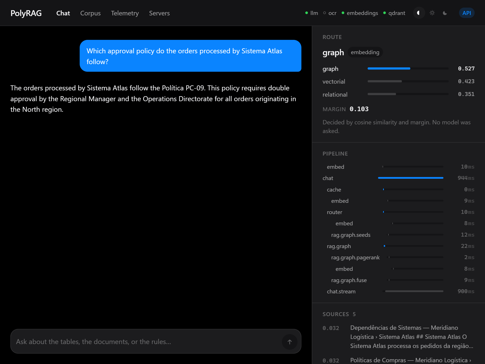
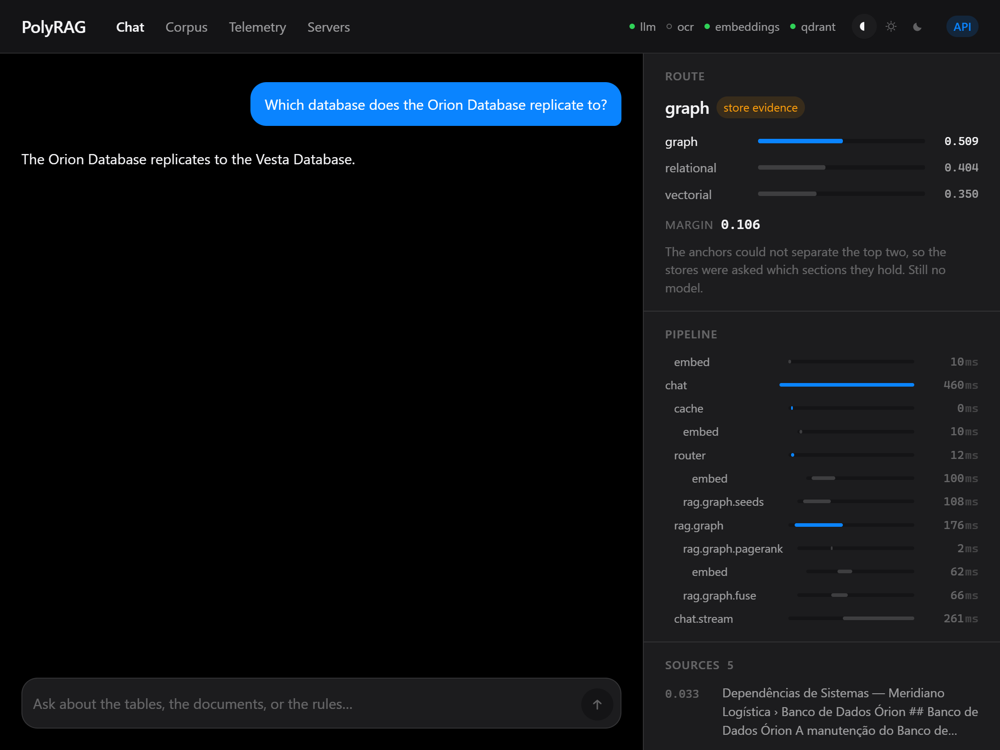
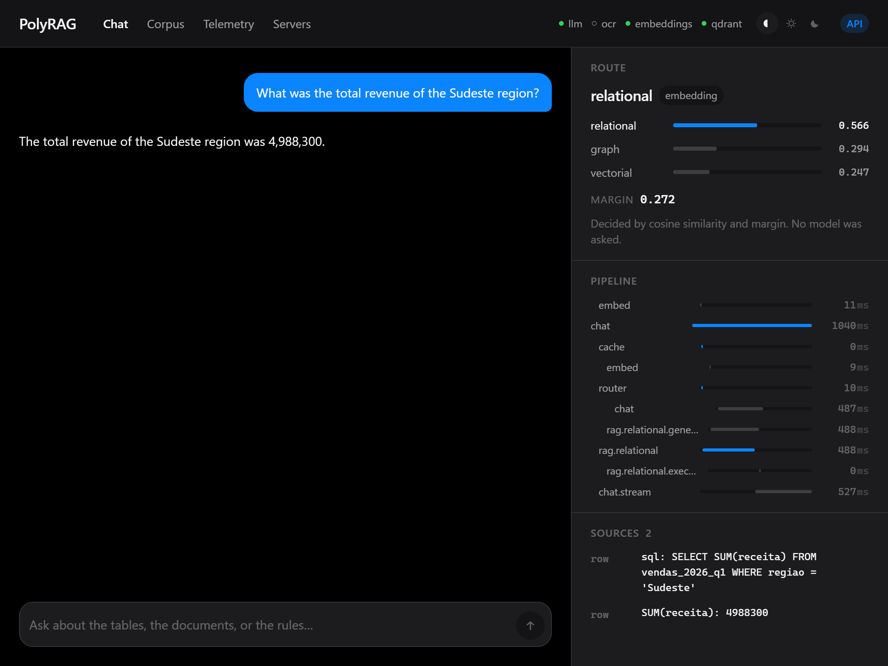
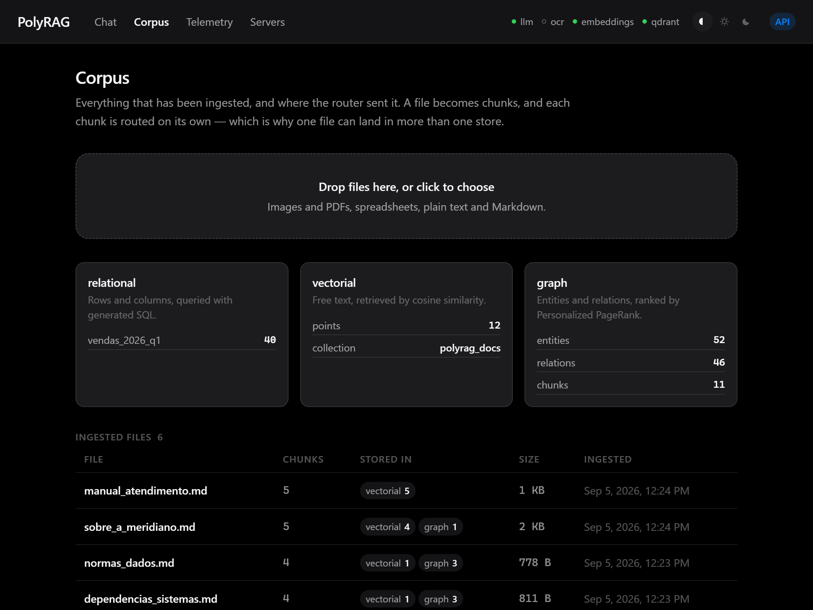
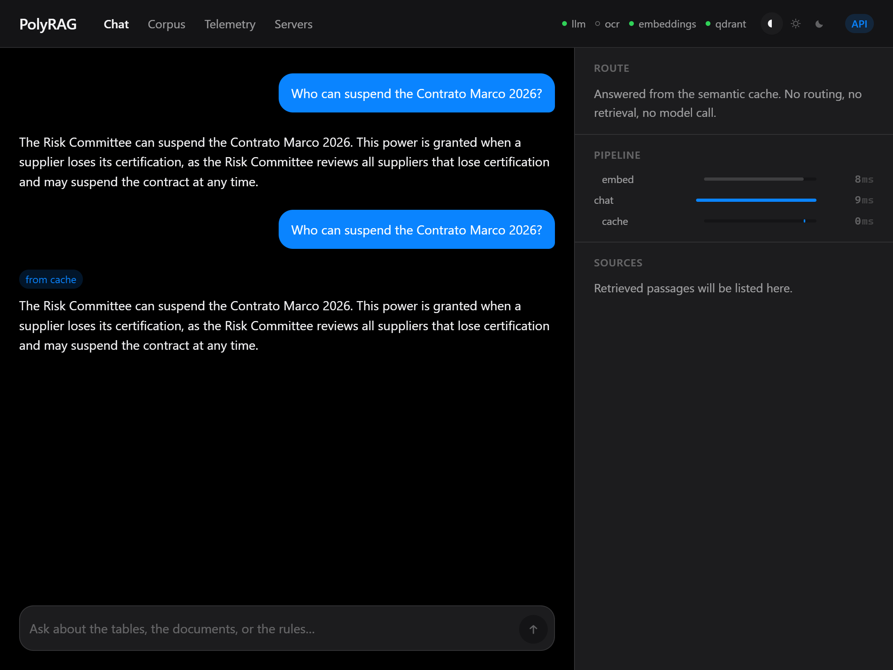
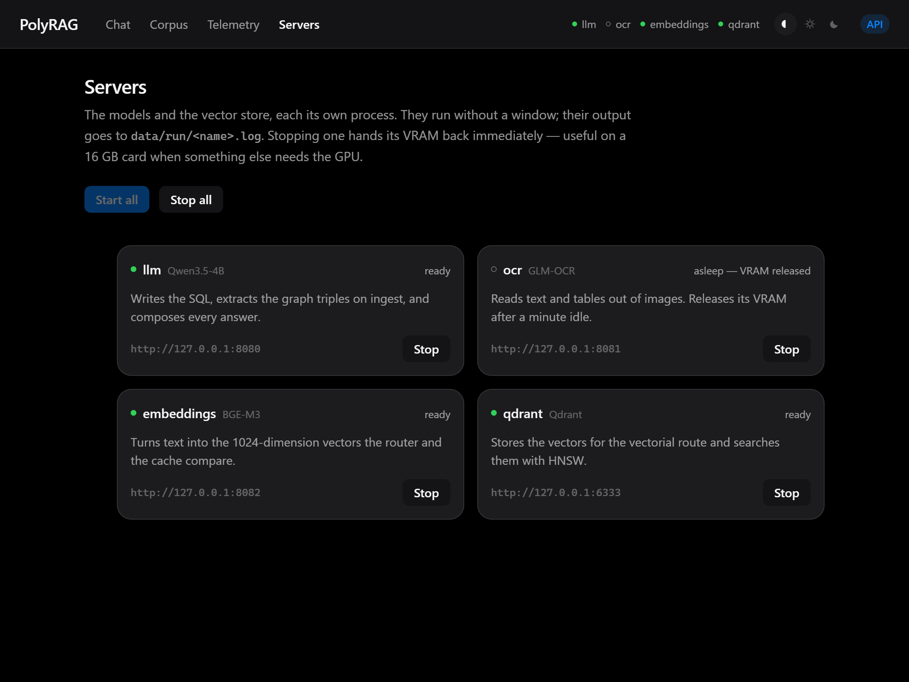

# PolyRAG

[](https://github.com/diegormirhan/polyrag/actions/workflows/ci.yml)

**A federated RAG system that routes questions with arithmetic instead of an agent, and shows you the arithmetic while it does it.**

Drop a spreadsheet, a scanned receipt and a policy document into one folder. PolyRAG reads each one,
splits it, and decides — per chunk — whether it belongs in a SQL table, a vector index, or a
knowledge graph. Ask a question and the same decision runs again to pick where to look. Every step
reports itself, so you can watch the routing happen and see the numbers behind it.

Runs entirely on one machine: AMD GPU through Vulkan, no CUDA, no Docker, no cloud.



*A question whose answer spans two documents that never mention each other. The right panel is the
whole point: the score each route got, the margin that decided it, and every step with its own
latency — `rag.graph.pagerank` at 1 ms next to `chat.stream` at 753 ms.*

---

## The problem it takes seriously

Agent-based RAG delegates routing to a model. That makes behaviour unpredictable — the same question
can take a different path on Tuesday, and nobody can explain why. That is what stops these systems
from being testable, debuggable or auditable.

PolyRAG's premise is the opposite: **use deterministic maths wherever it can decide, and reserve the
model for what only a model can do.**

| Step | How it decides | Deterministic? |
|---|---|---|
| Is this file tabular? | Regex + comma/digit density | ✅ |
| Which store does this belong in? | Cosine similarity + margin | ✅ |
| Is this question already answered? | Cosine ≥ threshold | ✅ |
| Which graph chunks matter? | Personalized PageRank | ✅ |
| Genuine tie between two routes | A model breaks it | ⚠️ rare, and marked as such |
| Writing the answer | A model | ⚠️ temperature 0 |

The claim is not a new algorithm. It is that **routing does not need one** — and that a system which
can explain its own decisions is worth more than one that guesses well.

---

## Architecture


Three models served by `llama.cpp` over Vulkan, each on its own port, all speaking the OpenAI API:
**Qwen3.5-4B** (SQL, triple extraction on ingest, and the answer — nothing in the router),
**GLM-OCR** (images),
**BGE-M3** (embeddings). Qdrant runs standalone alongside them. OCR sleeps when idle and hands its
VRAM back, so the resident set is about 5.6 GB.

---

## The router

The same component decides where a chunk is **stored** and where a question is **searched** — the
input is the only difference. It runs three stages, cheapest first:

**1 · Heuristic.** Comma and digit density. A spreadsheet is tabular by definition and never reaches
the model. Cost: microseconds.

**2 · Cosine + margin.** Each route is defined in `config.yaml` by a handful of example phrases,
embedded once at startup. The input is embedded and compared against all of them; the best match per
route becomes that route's score.

```
margin = score_top1 − score_top2

score_top1 ≥ tau_high  AND  margin ≥ delta   →  take it
score_top1 < tau_low                          →  fall back to free text
otherwise                                     →  gray zone, go to stage 3
```

This is a 1-nearest-neighbour classifier with a rejection rule. Cost: **8.8 ms**, measured.

**3 · Store evidence.** Only in the gray zone. The configured phrases say what a route is *for*;
they cannot know what a corpus turned out to contain. So each store is asked for the section
headings it actually holds (`RAGBase.content_anchors`), and the question is scored against those
too. Ingesting a document teaches the router about it with no config edit.

**There is no model in any of the three stages.** A model used to break the gray-zone tie, and it
was measured out: on those questions, stage 2 alone was right 9 times out of 10 and the judge 8. It
agreed with the geometry in 9 of the 10 — two model calls to repeat what arithmetic had already
said — and the one time it disagreed, it was wrong. Store headings took routing on unseen questions
from 82% to 95% instead.



*The gray zone, resolved without a model. Nothing hand-written in `config.yaml` could know that
"Banco de Dados Órion" names a section in the graph — so this question used to go to the relational
store, whose only table is about sales.*

---

## Three stores, because there are three kinds of data

| | Holds | Retrieved by | Why not the others |
|---|---|---|---|
| **RAG 1** · SQLite | Rows and columns | Generated SQL | Aggregation must be exact. Correct SQL gives the correct number; no model does the arithmetic. |
| **RAG 2** · Qdrant | Free text | Cosine over HNSW | No schema to impose, no relations to model — only meaning. |
| **RAG 3** · networkx | Entities and relations | Personalized PageRank | Multi-hop. "If A fails, what breaks?" needs topology, not similarity. |



*Why the first row of that table matters. The source is not a passage — it is the query that was
run and the row it returned. The figure came out of a `SUM`, so it is either right or the SQL is
wrong, and the SQL is on screen either way.*

RAG 3 is HippoRAG 2 reimplemented from the [paper](https://arxiv.org/pdf/2502.14802): the model
extracts subject–relation–object triples, networkx holds the graph, and the walk teleports back to
the question's entities so the ranking means "relevant to *this* question".

The official `hipporag` package needs `torch` and `vLLM`, which are Linux/CUDA only. Reimplementing
it was a constraint, and it turned out to be the more useful outcome — the maths is visible and
testable rather than hidden behind an import.



*Routing is per chunk, not per file — which is why `normas_dados.md` shows up in two stores. The
router sent three of its chunks to the graph; the fourth had no extractable relation, so it fell
back to free text rather than being dropped.*

---

## What is measured

`uv run python scripts/benchmark.py` on this machine (RX 9060 XT, 16 GB), 12 measured runs per
question after 2 discarded warm-ups. A single number cannot describe a latency — the first call
after a model loads pays for a cold cache, and the tail is what a user notices — so every row is
p50 and p95 rather than an average.

| | p50 | p95 |
|---|---:|---:|
| Routing decision (deterministic stage) | **8.8 ms** | 9.7 ms |
| Routing decision on the wire, streaming | **39 ms** | 65 ms |
| Time to first token | **223 ms** | 267 ms |
| Full answer, vectorial | **632 ms** | 632 ms |
| Full answer, relational | **737 ms** | 743 ms |
| Full answer, graph | **822 ms** | 827 ms |
| Cache hit, same question | **9.3 ms** | 9.5 ms |
| Share of a request spent inside model calls | **99 %** | |

Per stage, from each request's own spans rather than a second set of timers:
`pipeline.router` 8.8 ms, `rag.relational.generate_sql` 376 ms, `rag.graph.seeds` 76 ms,
`rag.graph.fuse` 54 ms, `rag.graph.pagerank` 1.0 ms.

Two of those are worth reading together: **Personalized PageRank, the algorithm the graph route is
named for, costs 1 ms — and everything around it costs 130.** Retrieval is not where the time goes;
99% of a request is the model writing the answer.

Two changes worth their own line, because both were found by instrumenting rather than guessing:

- **OpenIE 42.7 s → 7.4 s.** The GPU was 3.6 GB over capacity and streaming weights from system RAM.
  Sleeping the two intermittently-used models and halving the KV cache fixed it.
- **Answer accuracy 4/6 → 6/6** on a repeated multi-hop question, by dropping generation temperature
  from 0.2 to 0. Sampling was silently corrupting a third of the answers. *(n = 6, one question —
  enough to justify a free change, not enough to be a benchmark.)*

### Retrieval and answers, on two sets of 40 questions

Two sets, because one is not enough to tell capability from fit. `golden_set.yaml` is where the
failures were diagnosed and the thresholds chosen, which makes it a training set. `holdout_set.yaml`
was written afterwards from the same six documents and was never consulted while choosing an anchor,
a threshold or an algorithm. **The held-out column is the honest estimate**; the gap between the two
is the overfitting.

```bash
uv run python scripts/evaluate.py
uv run python scripts/evaluate.py --set eval/holdout_set.yaml
```

|              |  n | router | r@1 | r@5 | MRR | empty | facts |
|---|---:|---:|---:|---:|---:|---:|---:|
| **golden, overall**   | 40 | 90% | 73% | 88% | 0.81 | 4% | 91% |
| relational   | 12 | 100% | — | — | — | — | 100% |
| vectorial    | 12 | 83% | 75% | 83% | 0.79 | 8% | 88% |
| graph        | 16 | 88% | 72% | 91% | 0.83 | 0% | 87% |
| **held-out, overall** | 40 | **95%** | 68% | **89%** | 0.77 | **0%** | **94%** |
| relational   | 12 | 100% | — | — | — | — | 100% |
| vectorial    | 12 | 92% | 58% | 83% | 0.68 | 0% | 90% |
| graph        | 16 | 94% | 75% | 94% | 0.84 | 0% | 93% |

Where it started, before any of this: router 88%, recall@5 **57%**, empty **39%**, facts 74%.

`facts` asks whether the answer contained the figure or proper noun it had to contain — restricted
to what a model cannot legitimately reword, so a substring check measures correctness rather than
phrasing. Case, accents, thousands separators and number words are normalised on both sides, so
"cinco" and "5" count as the same answer. `recall@k` does not apply to the relational route, which
returns SQL rows rather than passages.

**`recall@1` is the one metric under 80%, and it has an arithmetic ceiling.** Three questions need
two passages to be fully answered, and no single chunk contains both, so the best achievable r@1 on
this set is 95%. It is also not what the system serves: the answer step receives the top 5, and
that column reads 88–89%.

#### What the measurement changed

**Named-entity extraction was removed from the search path.** It returned an empty list for 6 of the
16 graph questions — every one of them a question that *describes* what it wants instead of naming
it ("which rule governs personal data") — and graph search then returned nothing at all. Matching
the whole question against the entity names finds the right node in all 16, and deletes a model call
from every graph query. `empty` went from 39% to 0%.

**The model that broke routing ties was removed.** On the gray-zone questions, stage 2 alone was
right 9 times out of 10 and the judge 8. It agreed with the geometry in 9 of the 10 — two model
calls to repeat what arithmetic had already said — and the one time it disagreed, it was wrong.
Stage 3 now asks each store for its section headings instead, which took routing on unseen questions
from 82% to 95%: nothing written by hand in `config.yaml` could know that "Banco de Dados Órion"
names a section in the graph. **Every stage of the router is now arithmetic.**

**A reranker was not built.** The plan had recorded a suspicion that retrieval scores clustered too
tightly and that reranking was the fix. Conditioned on retrieval returning anything, recall@5 was
already 94% — the ordering was right and the coverage was not. That week would have gone to the
wrong half of the pipeline.

**Two things the SQL route was doing quietly.** Asked a question the sales table cannot answer, the
model wrote `SELECT * FROM vendas_2026_q1` and five arbitrary rows became the context for a
confident answer about the wrong subject. Worse, one query answered from itself:
`SELECT 'Banco de Dados Orion' AS banco, 'tempo real' AS frequencia FROM vendas_2026_q1` — valid,
read-only, and a hallucination wearing SQL syntax. Both are now rejected structurally, and a store
that returns nothing hands the question to the vector store instead of giving up.

Per-question detail, including every answer, is in `eval/golden_results.json` and
`eval/holdout_results.json`.

---

## The maths, in one page

Nothing here is hidden behind a library call. Every formula below is implemented in this repository
and covered by tests that run without a GPU.

**Embeddings.** BGE-M3 turns any text into 1024 numbers. Texts that mean similar things point in
similar directions — meaning becomes geometry, and comparing meanings becomes arithmetic.

**Normalisation.** Dividing a vector by its own length puts every vector on the unit sphere:

```
‖v‖ = √(v₁² + v₂² + … + vₙ²)          v̂ = v / ‖v‖
```

That is done once, at ingestion, for a reason. Cosine similarity is normally

```
cos(θ) = (a · b) / (‖a‖ · ‖b‖)
```

but for two already-normalised vectors both norms are 1, so **cosine collapses into the dot
product** — one multiply-add per dimension, no division, no square roots at query time.
`vectors.py` is nine lines because of that identity.

Cosine rather than Euclidean distance because a longer document produces a longer vector, and length
is not what the question is about. The angle carries the subject; the magnitude carries the word
count.

**The routing decision.** Each route owns a handful of example phrases from `config.yaml`, embedded
once at startup. An incoming text is scored against every anchor, and each route keeps its best
match — a 1-nearest-neighbour classifier, one per route. Then:

```
margin = score_top1 − score_top2
```

The margin, not the raw score, is what the decision turns on. Measured on this corpus the absolute
cosine sits in a narrow band (0.35–0.62) and separates almost nothing, while the margin separates a
confident decision from a genuine tie cleanly. That is why `tau_high` is a weak secondary guard and
`delta_margin` does the work. A tie falls through to a model — the classifier's rejection rule.

**Personalized PageRank.** Ordinary PageRank models a random walk: a node is important if important
nodes point at it, with a `1−d` chance of teleporting anywhere to avoid getting stuck.

```
PR(n) = (1−d)/N + d · Σ PR(v) / out(v)          d = 0.85
```

Personalized PageRank changes one thing: the teleport does not go anywhere, it goes **back to the
entities named in the question**. The stationary distribution then means "relevant to *this*
question" rather than "important in general". Multi-hop falls out of it — score flows along edges,
so a chunk two hops from the question's entity still receives some, which is how an answer can join
two documents that never mention each other.

**The cache.** A question's embedding is compared against every cached question with FAISS
`IndexFlatIP` — exact brute force by inner product, which is again cosine because the vectors are
normalised. Above the threshold, the stored answer is returned in about 12 ms. The threshold is
also the cache's open defect: see the limitations below.

**Why this matters here.** These steps are pure functions over numbers, which is what makes them
testable without a model server, reproducible across runs, and explainable after the fact. The
router's decision is under 11 ms of arithmetic whose inputs the panel can show you. That is the
whole argument.

---

## Running it

Needs Python 3.12, Node 22, and roughly 6 GB of VRAM.

One command does the whole install — it installs uv if missing, syncs the locked dependencies,
downloads the binaries and models, checks that Vulkan sees the GPU, and runs the tests. Every step
checks whether its work is already done, so re-running is safe:

```powershell
.\setup.ps1
```

`-SkipModels` leaves out the 4.9 GB download, `-SkipFrontend` skips npm, and `-Start` launches the
servers and the API when it finishes. Or do the same steps by hand:

```bash
# 1 · dependencies
uv sync
npm --prefix frontend ci

# 2 · binaries and models — about 4.9 GB, skips whatever is already there
uv run python scripts/fetch_runtimes.py

# 3 · everything the backend needs: three llama-servers and Qdrant
uv run python scripts/start_servers.py

# 4 · the API
uv run uvicorn --app-dir backend app.main:app --port 8000

# 5 · the interface
npm --prefix frontend run dev
```

The servers run windowless and log to `data/run/<name>.log`. Stop them with
`scripts/start_servers.py --stop`, or start and stop them individually from the **Servers** tab in
the interface — useful on a 16 GB card when something else needs the GPU.

Then open <http://localhost:5173>, or <http://localhost:8000/docs> for the API.

Drop a file into `data_drop/` and it is ingested within seconds — the hot folder is watched. Or use
the Corpus tab, which is the same code path.

For something to ask it about, [`demo/`](demo/README.md) holds a six-file corpus about one fictional
company, plus the questions that exercise each route and the two that do not work:

```bash
uv run python scripts/load_demo.py --reset
```

Everything is driven by `config.yaml`: ports, model paths, thresholds, prompts, and the example
phrases that define each route. **Adding a route is a config change, not a code change.**

---

## Verifying it

```bash
uv run pytest tests/ -q          # 79 tests, no servers required
uv run ruff check backend/ scripts/ tests/
npm --prefix frontend run check  # 0 errors
```

The unit tests cover cosine and margin, the routing decision, the read-only SQL guard, entity
normalisation and length limits, the tabularity heuristic, the cache, and every chunking rule. They
need no GPU and no network — which is the point of keeping that code pure.

The chunking tests exist because chunking is where most of this project's real bugs came from, and
they are verified by mutation rather than assumed: removing a guard has to fail exactly the test
that defends it. A regression test that cannot fail is decoration.

The scripts under `tests/` named `*_integration.py` are run by hand against a live stack and print
their results; pytest collects nothing from them.

```bash
uv run python scripts/evaluate.py    # the golden set, needs the servers and demo corpus
uv run python scripts/benchmark.py   # latency p50/p95, same requirements
```

---

## Seeing it run

Four views: Chat, Corpus, Telemetry and Servers. Chat pairs the conversation with a live panel that
shows the per-route cosine scores, the margin the decision turned on, which stage made the call, and
the span waterfall as it happens — the routing decision is on screen at about 39 ms, before
retrieval has even finished.



*The same question, asked twice. The second answer skips routing, retrieval and generation
entirely — three spans and 10 ms, against roughly 800 ms for the first.*



*Each model is its own process, running windowless. Stopping one hands its VRAM straight back,
which matters on a 16 GB card when something else needs the GPU. `ocr` shows hollow because it put
itself to sleep after a minute idle and gave back 2.08 GB on its own.*

The screenshots above are generated, not taken by hand — `uv run python scripts/screenshots.py`
drives Chrome over the DevTools protocol and rewrites them all. A screenshot nobody can regenerate
is one that quietly starts lying after the next UI change.

To reproduce the demo yourself:

```bash
uv run python scripts/start_servers.py
uv run python scripts/load_demo.py --reset
uv run uvicorn --app-dir backend app.main:app --port 8000
npm --prefix frontend run dev
```

Then ask, in order: a figure (`Qual foi a receita total da regiao Sudeste?`), something narrative
(`O que motivou a criacao do Sistema Atlas?`), a chain that crosses two files (`Os pedidos
processados pelo Sistema Atlas seguem qual politica de aprovacao?`), and finally any of them a
second time to watch the cache answer in 12 ms. [`demo/README.md`](demo/README.md) has the full
script, the expected figures, and the two questions that fail.

---

## Known limitations

Stated because they are real, not because they are theoretical:

- **The semantic cache can serve the wrong answer.** Measured, not theoretical: ask for the
  Sudeste revenue, then ask for the Nordeste revenue, and the second question is answered from
  cache with the first one's figure. The two questions differ by one word in a long sentence, so
  they score 0.917 against each other — above the 0.80 threshold. Raising the threshold does not
  fix it: legitimate paraphrases of the same question score 0.771 to 0.911, so the ranges overlap
  and no single cutoff separates them. `scripts/benchmark.py` reports cache hits and misses
  separately so this stays visible.
- **The router's anchors are a snapshot taken at startup.** Ingesting a document does not teach the
  router about it until the process restarts, because the section headings each store contributes
  are embedded once in `Router.create`.
- **Store headings carry proper nouns, and proper nouns collide.** The heading "Contratos marco"
  pulls "qual foi a receita do mes de marco" toward the graph, because *março* the month and
  *Marco* the contract normalise to the same word. It costs two questions on the golden set and is
  the price of letting the corpus speak for itself.
- **`recall@1` sits at 68–73%.** Its ceiling on these sets is 95%, since three questions need two
  passages and no chunk holds both. The answer step is served the top 5, where recall is 88–89%.
- **The retrieval numbers describe a 24-chunk corpus.** With top-5 over 10 graph chunks, half the
  store is returned every time, which is not a hard retrieval problem. Measured on this corpus,
  plain cosine over chunk text beat Personalized PageRank at ranking (88% vs 66% r@1); the two are
  fused precisely because neither dominates, and a larger corpus is what would settle it.
- **Source files (`.py`, `.ts`, …) are not supported.** Doing it properly needs AST-aware chunking
  and probably a fourth route; adding the extension to the config would route code by accident
  rather than by decision.
- **Images and tables embedded inside PDFs and DOCX are skipped.** Only their text is extracted.
- **A filename can only be ingested once.** Re-ingesting a changed file requires renaming it.
- **`llama.cpp` is not bit-for-bit deterministic even at temperature 0.** The maths in this project
  is; the model steps have residual variance, and saying otherwise would be the imprecision this
  project criticises.

---

## Stack

`FastAPI 0.141` · `Qdrant 1.19` · `networkx 3.6` · `faiss-cpu 1.15` · `OpenTelemetry 1.44` ·
`SvelteKit 2.63` · `Svelte 5` · `llama.cpp` (Vulkan) · `uv`

No PyTorch, no vLLM, no Ollama, no Docker, no WSL.
